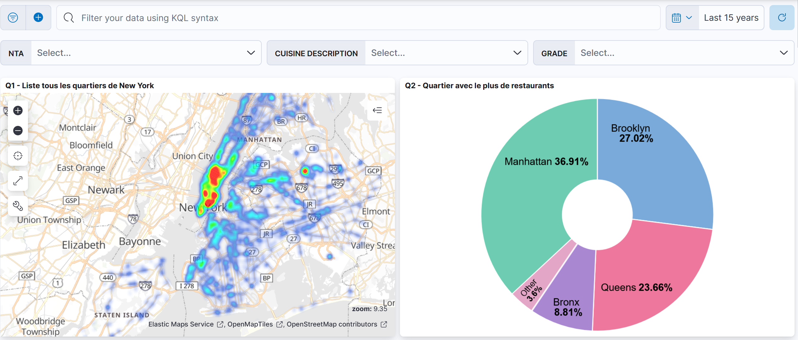
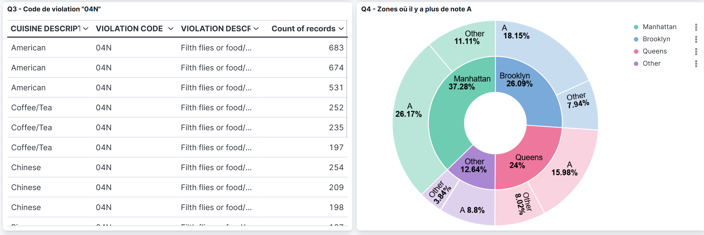
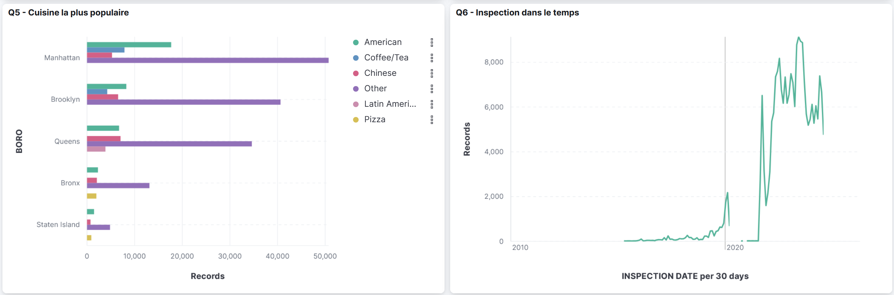
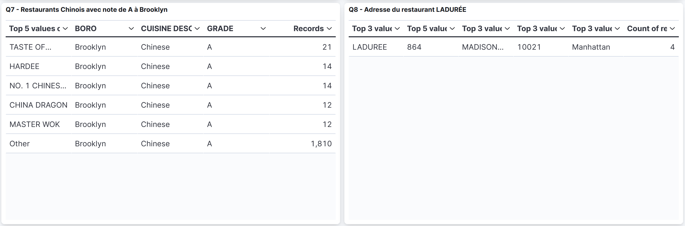
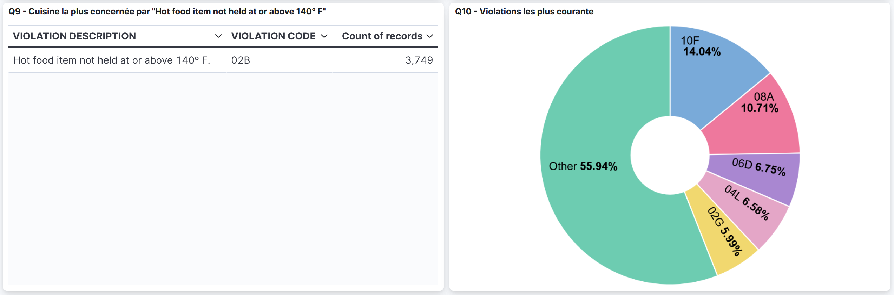
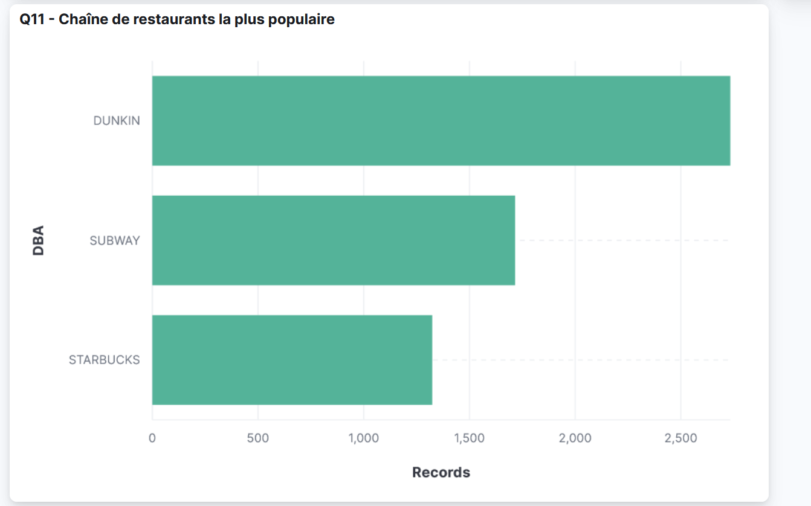

# Prérequis

Pour exécuter les requêtes suivantes, vous devez avoir un cluster Elasticsearch en cours d'exécution avec l'index `ny_restau_final` chargé avec les données des restaurants de New York.

Pour avoir 'index `ny_restau_final`, vous pouvez suivre les étapes suivantes :

Charger vos données autant ny_restau puis éxecuter ces fonctionalités de transformation et d'enrichissement pour obtenir l'index final `ny_restau_final`.

```
PUT ny_restau_final
{
  "mappings": {
    "_meta": {
      "created_by": "file-data-visualizer"
    },
    "properties": {
      "@timestamp": {
        "type": "date"
      },
      "ACTION": {
        "type": "text"
      },
      "BBL": {
        "type": "long"
      },
      "BIN": {
        "type": "long"
      },
      "BORO": {
        "type": "keyword"
      },
      "BUILDING": {
        "type": "keyword"
      },
      "CAMIS": {
        "type": "long"
      },
      "CRITICAL FLAG": {
        "type": "keyword"
      },
      "CUISINE DESCRIPTION": {
        "type": "keyword"
      },
      "Census Tract": {
        "type": "long"
      },
      "Community Board": {
        "type": "long"
      },
      "Council District": {
        "type": "long"
      },
      "DBA": {
        "type": "text"
      },
      "GRADE": {
        "type": "keyword"
      },
      "GRADE DATE": {
        "type": "date",
        "format": "MM/dd/yyyy"
      },
      "INSPECTION DATE": {
        "type": "date",
        "format": "MM/dd/yyyy"
      },
      "INSPECTION TYPE": {
        "type": "keyword"
      },
      "Latitude": {
        "type": "double"
      },
      "Longitude": {
        "type": "double"
      },
      "NTA": {
        "type": "keyword"
      },
      "PHONE": {
        "type": "keyword"
      },
      "RECORD DATE": {
        "type": "date",
        "format": "MM/dd/yyyy"
      },
      "SCORE": {
        "type": "long"
      },
      "STREET": {
        "type": "keyword"
      },
      "VIOLATION CODE": {
        "type": "keyword"
      },
      "VIOLATION DESCRIPTION": {
        "type": "text",
        "fields": {
          "keyword": {
            "type": "keyword",
            "ignore_above": 512
          }
        }
      },
      "ZIPCODE": {
        "type": "keyword"
      },
      "location": {
        "type": "geo_point"
      }
    }
  }
}
```
Ici on prend tout les champs de l'index ny_restau et on ajoute le champs "VIOLATION DESCRIPTION" en forme keyword pour pouvoir l'utiliser dans les visualisations.

Aprés on éxecute ce script pour remplir l'index `ny_restau_final`:

```
POST _reindex
{
  "source": {
    "index": "ny_restau"
  },
  "dest": {
    "index": "ny_restau_final"
  }
}
```

Pour tester que l'index est bien créé et rempli, vous pouvez exécuter la requête suivante :

```
GET ny_restau_final/_mapping
```


# Requetes

- Q1: List all the neighborhoods in New York.
```
GET ny_restau_final/_search
{
  "size": 0,
  "aggs": {
    "neighborhoods": {
      "terms": {
        "field": "NTA",
        "size": 5000
      }
    }
  }
}
```
- Q2: Which neighborhood has the most restaurants?
```
GET ny_restau_final/_search
{
  "size": 0,
  "aggs": {
    "most_populated_neighborhood": {
      "terms": {
        "field": "NTA",
        "size": 1,
        "order": {
          "_count": "desc"
        }
      }
    }
  }
}
```
- Q3: What does the violation code "04N" correspond to?
```
GET ny_restau_final/_search
{
  "size": 1,
  "_source": ["VIOLATION DESCRIPTION"],
  "query": {
    "term": {
      "VIOLATION CODE": "04N"
    }
  }
}

```

- Q4: Where are the restaurants (name, address, neighborhood) that have a grade of A?
```
GET ny_restau_final/_search
{
  "size":10000,
  "_source": ["DBA","STREET","NTA"],
  "query": {
    "term": {
      "GRADE": "A"
    }
  }
}
```
- Q5: What is the most popular cuisine? And by neighborhood?
```
GET ny_restau_final/_search
{
  "size": 0,
  "aggs": {
    "most_popular_cuisine": {
      "terms": {
        "field": "CUISINE DESCRIPTION",
        "size": 1,
        "order": {
          "_count": "desc"
        }
      }
    },
    "by_neighborhood": {
      "terms": {
        "field": "NTA",
        "size": 100,
        "order": {
          "_count": "desc"
        }
      },
      "aggs": {
        "top_cuisine": {
          "terms": {
            "field": "CUISINE DESCRIPTION",
            "size": 1,
            "order": {
              "_count": "desc"
            }
          }
        }
      }
    }
  }
}
```
- Q6: What is the date of the last inspection?
```
GET ny_restau_final/_search
{
  "size": 0,
  "aggs": {
    "last_inspection": {
      "max": {
        "field": "INSPECTION DATE"
      }
    }
  }
}
```
- Q7: Provide a list of Chinese restaurants with an A grade in Brooklyn.

```
GET ny_restau_final/_search
{
  "size":10000,
  "_source": ["DBA"],
  "query": {
    "bool": {
      "must": [
        {
          "match": {
            "CUISINE DESCRIPTION": "Chinese"
          }
        },
        {
          "term": {
            "GRADE": "A"
          }
        },
        {
          "term": {
            "BORO": "Brooklyn"
          }
        }
      ]
    }
  }
}
```
- Q8: What is the address of the restaurant LADUREE?

```
GET ny_restau_final/_search
{ 
  "_source": ["STREET", "BORO", "BUILDING", "ZIPCODE"],
  "query": {
    "match": {
      "DBA": "LADUREE"
    }
  }
}
```

- Q9: What cuisine is most affected by the violation "Hot food item not held at or above 140º F"?

```
GET ny_restau_final/_search
{
  "size": 0,
  "query": {
    "match_phrase": {
      "VIOLATION DESCRIPTION": "Hot food item not held at or above 140º F"
    }
  },
  "aggs": {
    "ViolatedCuisine": {
      "terms": {
        "field": "CUISINE DESCRIPTION",
        "size": 1,
        "order": {
          "_count": "desc"
        }
      }
    }
  }
}
```

- Q10: What are the most common violations (Top 5)?
```
GET ny_restau_final/_search
{
  "size":0,
  "aggs": {
    "most_common_violations": {
      "terms": {
        "field": "VIOLATION CODE",
        "size": 5,
        "order": {
          "_count": "desc"
        }
      }
    }
  }
}
```
- Q11: What is the most popular restaurant chain?
```

GET ny_restau_final/_search
{
  "size":0,
  "aggs": {
    "Mostpopular_Restau": {
      "terms": {
        "field": "CAMIS",
        "size": 1,
        "order": {
          "_count": "desc"
        }
      }
    }
  }
}

# Q11 with name
GET ny_restau_final/_search
{
  "size": 0,
  "aggs": {
    "Mostpopular_Restau": {
      "terms": {
        "field": "CAMIS",
        "size": 1,
        "order": {
          "_count": "desc"
        }
      },
      "aggs": {
        "restaurant_name": {
          "top_hits": {
            "_source": ["DBA"],
            "size": 1
          }
        }
      }
    }
  }
}
```

# visualisations



- Q1 :
Cette carte affiche la répartition géographique des restaurants à travers les différents quartiers de New York.
On observe une forte concentration d’établissements à Manhattan, suivie de Brooklyn et Queens, ce qui correspond aux zones urbaines les plus denses.

- Q2 :
Le diagramme circulaire illustre la part de chaque quartier dans le total des restaurants.
Manhattan est en tête avec environ 36,9 %, suivi de Brooklyn (27 %) et Queens (23 %).
Cela montre que Manhattan regroupe la majorité des restaurants de la ville.



- Q3 :
Cette table affiche les enregistrements associés au code de violation “04N”.
Ce code correspond à “Filth flies or food/refuse/sewage associated with (FRSA) flies or other nuisance pests in establishment’s food and/or non-food areas. FRSA flies include house flies, blow flies, bottle flies, flesh flies, drain flies, Phorid flies and fruit flies.”, c’est-à-dire la présence de mouches ou de saletés dans la zone de préparation.
On observe que ce type de violation touche principalement les restaurants de type American, Coffee/Tea et Chinese.

- Q4 :
Le graphique en anneaux montre la répartition des notes A attribuées aux restaurants selon le quartier.
Manhattan compte environ 26,17 % des notes A, suivi de Brooklyn (26,09 %) et Queens (24 %).



- Q5 :
Le graphique en barres présente les types de cuisine les plus représentés selon les arrondissements de New York.
La cuisine américaine domine nettement à Manhattan, tandis que la cuisine chinoise est particulièrement présente à Brooklyn et Queens.

- Q6 :
Ce graphique linéaire illustre l’évolution du nombre d’inspections sanitaires entre 2010 et 2025.
On observe une activité très faible avant 2018, suivie d’une forte augmentation à partir de 2020, où le nombre d’inspections dépasse fréquemment les 6 000 enregistrements par période.
Cette hausse des contrôles sanitaires est possiblement liée à la pandémie (COVID-19).



- Q7 :
Ce tableau recense les restaurants chinois situés à Brooklyn ayant obtenu la note A lors des inspections.
Parmi les établissements les plus fréquemment inspectés et bien notés, on trouve TASTE OF CHINA, HARDEE, NO. 1 CHINESE RESTAURANT, CHINA DRAGON et MASTER WOK.
  
- Q8 :
Ce tableau affiche les informations détaillées du restaurant Ladurée, situé à 864 Madison Avenue, Manhattan (10021).
Le résultat montre que plusieurs inspections ont été enregistrées pour ce même établissement (4 au total).



- Q9 : Ce tableau met en évidence la violation 02B, correspondant à “Hot food item not held at or above 140°F”, c’est-à-dire les plats chauds conservés en dessous de la température réglementaire.

- Q10 : Le diagramme en anneau illustre la répartition des codes de violation les plus fréquents dans les inspections sanitaires.
Les principales infractions sont les codes 10F (14,04 %), 08A (10,71 %), 06D (6,75 %), 04L (6,58 %) et 02G (5,99 %).



- Q11 : Le graphique en barres met en évidence les chaînes de restauration les plus présentes à New York selon le nombre d’enregistrements dans la base.
Dunkin’ arrive largement en tête, suivie de Subway et Starbucks.
